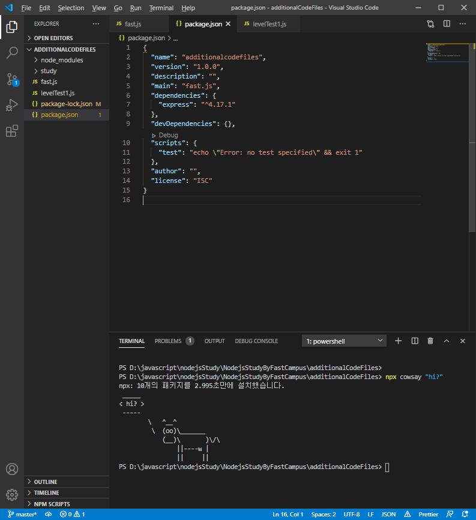
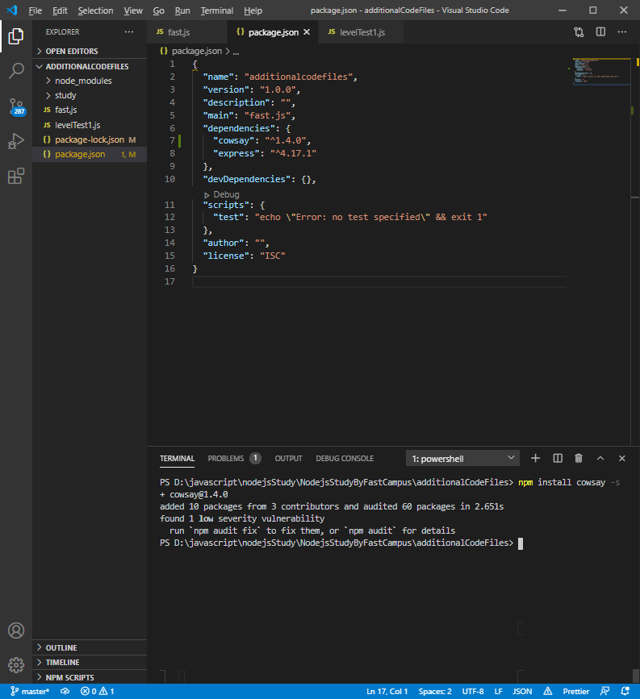

# Node.js Study Chapter1
**study by FastCampus part1**

## Before start Nodejs

기본적으로 nodejs 는 window, mac, ubontu 모두를 지원한다.


여기서 LTS 는 Long Term Service 의 약자로 오랜시간동안 지원을 하기로 약속된 nodejs의 기능을 가지고 있는 nodejs 환경이며 current version 은 최신의 nodejs 를 사용할 수 있는 환경이다. 공부를 하기 위한 nodejs 이므로 Current version 를 설치하는 것이 좋다.

## 1. Browser js VS Node.js

기본적으로 Nodejs 역시 javascript 를 기반으로 만들어진 런타임이므로 거의 대부분의 문법을 javascript와 공유하나 일부는 다르다. 이에 대해 알아보자.

### 1. window 객체

window 객체는 브라우저창을 나타내는 객체이다. 이러한 window 객체는 Browser 가 존재하는 부분 즉 프론트에서만 쓰이게 된다. Nodejs는 백엔드를 작업하는 런타임이므로 이러한 브라우저 창이 없다.

### 2. webpack

프론트엔드의 개발에 있어서 외부 웹팩을 접근하여 사용할 때 import 를 사용한다. 하지만 nodejs에서는 별도의 세팅이 없을 경우 require 를 통해 웹팩을 정의하거나 사용할 수 있다.

## 2. npm

npm 은 nodejs 에서 사용하는 package manager 이다. npm 에 관련된 몇가지 명령어를 알아보자.

1. npm install `packagename` -s / npm install `packagename` -g

-s : `packagename` 이라는 패키지를 해당 폴더 안에 설치한다.
-g : `packagename` 이라는 패키지를 해당 폴더 외에서도 쓸 수 있게 전역에 설치한다.

2. npm init

npm init 은 기본적으로 npm 모듈을 사용하기 위해 초기화를 해 주는 명령어인데. 로컬터미널로 이 명령어를 실행하면 오류가 발생한다. 따라서 이러한 오류문구의 제거를 위해 `npm install express --save-dev` 명령어를 먼저 사용한다.

3. npx

npx 는 설치를 하지만 그 후에 실행을 바로 할 수 있도록 도와주는 명령어이다. npx 는 실행이 주요한 목적으로 사용하는데 react 를 배울 때 다시 공부해보자.

4. npm uninstall `packagename` -s / npm uninstall `packagename` -s

-s : `packagename` 이라는 로컬에 설치된 파일을 제거한다.
-g : `packagename` 이라는 전역에 설치된 파일을 제거한다.

## 3. Sementic versioning

Sementic versioning 은 npm 에서 제공하는 버전관리 규약이다. 주로 x . y. z 같이 3자리로 사용을 하는데 3자리로 사용하는 버전이라고 해서 npm 이 제공하는 규칙을 따르는 것은 아니다. 이에 대해 알아보자.

* **처음 release** 되는 프로그램의 version 은 **1.0.0 부터 시작**한다.
* bug fix를 한 후 **하위 버전과 호환이 되면** **3번째 자리만 숫자가 올라간다**.
* **하위호환이 가능**하지만 **새로운 기능이 추가**되었을 때 **2번째 자리가 올라간다**.
* **하위호환이 되지 않는 중대한 변화**나 **소스의 수정**이 있으면 **첫번째 자리가 올라간다**.

|Code Status|Stage|Rule|Example|
|--|--|--|--|
|First Release|New product|Start With 1.0.0|1.0.0|
|Backword compatible bug fixes|Patch release|Increment the third digit|1.0.1|
|Backword compatible new features|Minor release|Increment the middle digit and reset last digit to zero|1.1.0|
|Changs that break backward compatibility|Major release|Increment the first digit and reset middle and last digits to zero|2.0.0|

## 4. npx

`npm` 은 패키지를 로컬이든 서버든 어떠한 저장소에 직접 설치가 되는 방식인 반면 `npx` 는 저장하고 실행하는 것이 목적이 아니라 1회성으로 어떠한 패키지가 사용자가 작성한 코드에서 어떻게 작동하는지 확인하고 싶을 때 사용한다. 밑의 소스창을 보자

**[Terminal-npx 실행]**
```
npx cowsay "hi?"
```

**[실행창]**


**[Terminal-npm 실행]**
```
npm install cowsay --s
```

**[실행창]**
\

위의 `npx` 를 실행했을 때 `package.json` 파일에서 `cowsay` 라는 패키지가 설치되지 않았음을 볼 수 있다. 이런식으로 소스를 작성하던 도중 만약 어떠한 package 를 설치하고 사용했을 때 어떻게 되는지 **임시로 확인**하는 것이 npx 의 장점이다.

## 5. nodemon

`nodemon` 은 파일에 변화게 생기면 그 파일을 감지를 해서 바로 실행을 하게 된다. 변화를 바로바로 적용할 수 있게 해 주는 패키지이다.

**[설치]**
```
npm install --s
```

## 5.Data Structure for Event Loop

1.  Queue : First in First out, 선입선출

**[SOURCE]**

```javascript
const queue = [];
queue.push(1);
queue.push(2);
queue.push(225)
console.log(`queue before pop : [${queue}]`);

const r = queue.shift();
console.log(`queue poped: [${queue}]`);
console.log(`delete 된 값 : ${r}`);
```

**[CONSOLE]**

```
queue before pop : [1,2,225]
queue poped: [2,225]
delete 된 값 : 1
```


큐는 위의 소스에서 볼 수 있듯이 shift로 구현할 수 있다. 헷갈린다면 [이 링크](https://github.com/jeahun10717/javascriptStudy/blob/master/javascriptStudyByDRCD/javascriptByDRCD3.md#4-%EB%B0%B0%EC%97%B4%EC%9D%98-%EC%B6%94%EA%B0%80-%EC%82%AD%EC%A0%9C-_-addition-deletion) 를 참조하라.

2. Stack : First in Last out, 선입후출

```javascript
const stack = [];
stack.push(1);
stack.push(2);
stack.push(225)
console.log(`stack before pop : [${stack}]`);

const r = stack.shift();
console.log(`stack poped: [${stack}]`);
console.log(`delete 된 값 : ${r}`);
```

**[CONSOLE]**

```
stack before pop : [1,2,225]
stack poped: [1,2]
delete 된 값 : 225
```

스택은 위의 소스에서 볼 수 있듯이 pop 으로 구현할 수 있다. 큐와 마찬가지로 헷갈린다면 [이 링크](https://github.com/jeahun10717/javascriptStudy/blob/master/javascriptStudyByDRCD/javascriptByDRCD3.md#4-%EB%B0%B0%EC%97%B4%EC%9D%98-%EC%B6%94%EA%B0%80-%EC%82%AD%EC%A0%9C-_-addition-deletion)를 참조하라.

## 6. every

`every` 는 배열에서 그 안의 모든 요소가 특정조건을 만족하면 `true`, 만족하지 못하면 `false` 를 반환한다. 이 `every` 를 사용하게 되면 기존의 배열을 검사하기 위해서는 모두 순회를 해야 하기 때문에 for 와 if 를 사용해서 알아내야 하는 단점을 없앴 수 있다.

**[SOURCE]**

```javascript
const arr = [2, 3, 4]

const isBiggerthenOne = arr.every(key => key > 1)
const isBiggerthenTwo = arr.every(key => key > 2)

console.log(isBiggerthenOne);
console.log(isBiggerthenTwo);
```

**[CONSOLE]**

```
true
false
```

## 7. Find, includes

1. Find : 배열에서 특정한 element 를 찾으면 찾은 값을 return, 찾지 못하면 undefined 를 return 한다.
2. includes : 배열에서 특정한 elemnet 를 찾으면 true, 찾지 못하면 false 를 retrun 한다.

**[SOURCE]**

```javascript
const arr = ['nodejs', 'all in one']

const ret = arr.find(key=>key==='all in one')
const res = arr.includes('nodejs')

console.log(ret);
console.log(res);
```

**[CONSOLE]**

```
all in one
true
```
