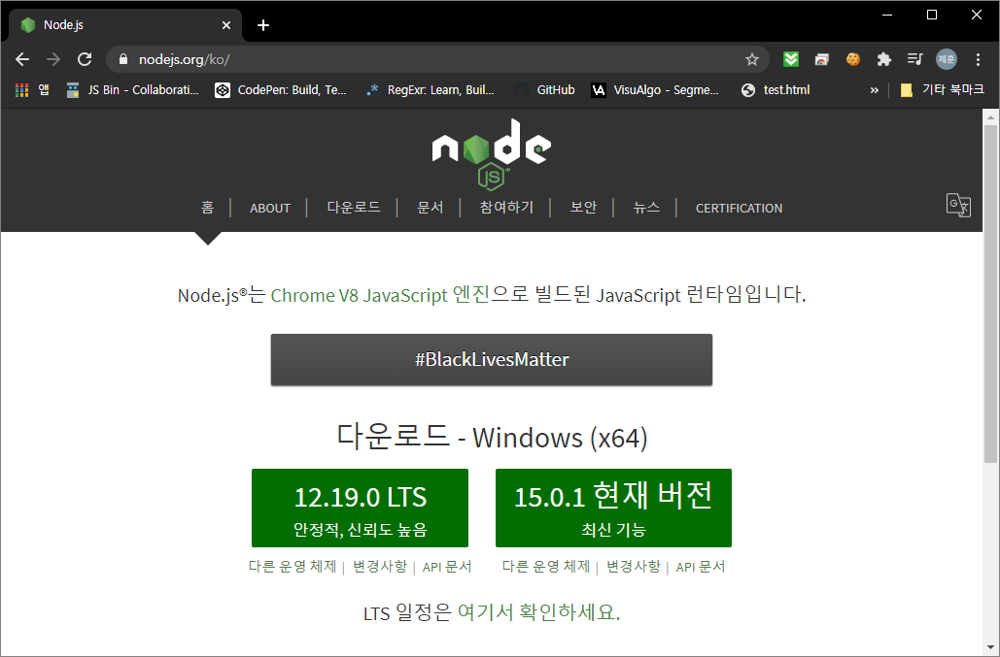

# Node.js : part1
**study by FastCampus**

## 1. 개발환경설정

기본적으로 nodejs 는 window, mac, ubontu 모두를 지원한다.

여기서 LTS 는 Long Term Service 의 약자로 오랜시간동안 지원을 하기로 약속된 nodejs의 기능을 가지고 있는 nodejs 환경이며 current version 은 최신의 nodejs 를 사용할 수 있는 환경이다. 공부를 하기 위한 nodejs 이므로 Current version 를 설치하는 것이 좋다.
