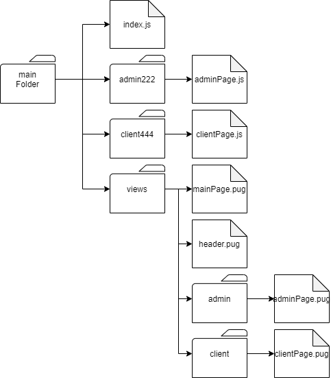

# Node.js Express study part1
## [express 강의 참고링크](https://github.com/parkjunyoung/express-online)

## Express 시작

## 1. Express를 사용하는 이유


웹서버에서 사용자는 서버에게 요청을 하고 그 요청에 대한 답을 서버는 사용자에게 제공한다. 이러한 요청과 반응의 소스를 만들주는 것을 프레임워크라 한다. 여러가지의 프레임워크가 존재하는데 우리는 express 에 대해 알아볼 것이다. express 는 기존의 사용자가 많아 관련된 자료가 많고 코드 작성을 줄여주는 유용한 api 들이 많기 때문에 사용하기 편하다.

## 2. 서버 만들어 보기

### 1. express 가 아닐 경우

```javascript
const http = require('http');

http.createServer((request, response)=>{
    response.writeHead(200, {'Context-Type' : 'text/plain'})
    response.write('Hello Server')
    response.end();
}).listen(3000);
```

위의 소스에서 3000 번의 포트에 서버를 생성하는 코드이다. response.writeHead 의 200 은 http 상태 코드인데 밑의 표를 참조하라.

|상태코드|설명|
|--|--|
|1XX|조건부응답|
|2XX|응답성공|
|3XX|리아이렉션|
|4XX|요청오류(ex 404 Not Found)|
|5XX|서버오류|

### 2. express 로 서버를 띄울 경우

**[SOURCE]**

```javascript
const express = require('express')

const app = express();
const port = 3000;

app.get('/', (req, res) => {
    res.send('hello express');
});

app.listen(port, ()=>{
    console.log('Express Listening on Port', port);
})
```

**[CONSOLE]**
```
Express Listening on Port 3000
```

express 의 모듈을 require 를 통해 가져오고 app 에 express 모듈을 사용하며 저장했다. 이 때 만약에 수정사항이 생겨서 수정한 후 저장을 하더라도 수정된 소스는 반영이 되지 않는다. 서버는 이미 이전의 소스로 작동하고 있으므로 서버를 닫은 후 다시 열어서 수정사항을 반영하여야 한다. 이러한 소스의 변화를 실시간으로 감지하여 바로 반영할 수 있는 패키지가 2개 있다.

* supervisor
1. 설치
```
npm install supervisor -s
```
2. 실행
```
supervisor 파일명
```

* nodemon
1. 설치
```
npm install nodemon -s
```
2. 실행
```
nodemon 파일명
```

또한 이러한 모듈들을 사용자화 하여 npm 을 통해 호출 할 수 있다.

**[SOURCE-JSON]**

```json
{
  "name": "practice",
  "version": "1.0.0",
  "description": "express 연습",
  "main": "index.js",
  "scripts": {
    "test": "echo \"Error: no test specified\" && exit 1",
    "start": "supervisor index.js"  
  },
  "author": "jeahun",
  "license": "ISC",
  "dependencies": {
    "express": "^4.17.1"
  }
}

```

위의 json 소스에서 "scripts" 부분에서 "start" : "supervisor index.js" 를 추가하면 밑의 방식으로 패키지 사용이 가능하다. 이러한 방식으로 터미널에서 사용하는 npm 을 사용자화 하여 사용 할 수 있다.

**[TERMINAL]**
```
npm start
```

**[CONSOLE]**
```
Starting child process with 'node index.js'
Watching directory 'D:\javascript\nodejsStudy\expressStudyByFastCampus\additionalSouceCode\practice' for changes.
Press rs for restarting the process.
Express Listening on Port 3000
Received SIGINT, killing child process...
Parent process exiting, terminating child...
```

CONSOLE 창에서 볼 수 있듯 정상적으로 작동한다.


## 3. router

웹페이지의 복잡도가 지나치게 올라가면 수정이나 보완이 힘들다. 이러한 유지보수성을 올리기 위해 라우터를 사용하여 소스의 복잡도를 낮출 수 있다.

* 밑의 도표를 코딩한다고 가정하고 라우터를 쓰지 않는 코드와 라우터를 쓰는 코드를 비교해보자.


### 1. none Routes coding

**[SOURCE_noneRoutes]**

```javascript
const express = require('express');
const app = express();
const port = 3300;

app.get('/', (req, res)=>{
    res.send('this is main page')
})

app.get('/contact', (req, res)=>{
    res.send('url : localhost:3300/contact')
})

app.get('/producer',(req, res)=>{
    res.send('url : localhost:3300/producer')
})

app.get('/contact/list', (req, res)=>{
    res.send('url : localhost:3300/contact/list')
})

app.listen(port, ()=>{
    console.log('Express listening on port', port);
})
```
### 2. use Routes coding

**파일 구조**


**[SOURCE_index.js]**

```javascript
const express = require('express');//express 모듈 사용

const contact = require('./contactRoutes/contact')//contact.js 소스가져옴
const producer = require('./producerRoutes/producer')//producer.js 소스가져옴

const app = express();
const port = 3300;

app.get('/', (req, res)=>{//메인페이지
    res.send('this is main page')
})

app.use('/contact', contact)//contact.js 소스 사용함
app.use('/producer', producer)//producer.js 소스 사용함

app.listen(port, ()=>{
    console.log('Express listening on port', port);
})
```

**[SOURCE_contact.js]**

```javascript
const express = require('express');//express 모듈 사용
const routerOfContact = express.Router();//express 모듈의 router 사용

routerOfContact.get('/', (req, res)=>{
    res.send('URL : localhost:3300/contact');
});

routerOfContact.get('/list', (req, res)=>{
    res.send('URL : localhost:3300/contact/list');
});

module.exports = routerOfContact;
//module.exports 를 통해 routerOfContact 를 내보냄
```

**[SOURCE_producer.js]**

```javascript
const express = require('express');
const routerOfProducer = express.Router();

routerOfProducer.get('/', (req, res)=>{
    res.send('URL : localhost:3300/producer');
});

module.exports = routerOfProducer;
```

### 3. Multi Router Source

프랙탈 구조로 라우터를 연속적으로 사용하는 소스가 있다. [이 링크](https://github.com/jeahun10717/nodejsStudy/tree/master/expressStudyByFastCampus/additionalSouceCode)에 4_multi_router 부분 다운받으면 된다.


## 4. view engine

view engine 은 기존의 html 을 보조하는 수단으로 나온 엔진이다. 여러가지 엔진이 존재하는데 여기서는 nunjucks 에 대해 알아볼 것이다. 탬블릿 엔진을 사용해야 하는 자세한 이유는 [이 링크](https://insight-bgh.tistory.com/252) 를 참고하라
### 1. nunjucks

#### 1. 설치

```
npm install nunjucks --s
```

#### 2. 사용법

**[SOURCE_mainJSFile]**

```javascript
const 변수1 = require('nunjucks')

nunjucks.configure('views'/*1번*/, {
  autoescape : true,//2번
  express : app//3번
})
//1번 : 문자열 안에 들어가는 문자열은 view 파일이 들어가는 폴더명이다.
//2번 : autoescape 는 보안을 위해 작성한다 후에 설명하겠다.
//3번 : express : app 에서 app 은 express 모듈이 저장되어 있는 변수이다.
```

**[SOURCE_adminPageJSfile]**

```javascript
router.get('/', (req, res)=>{
    // res.send('this is producer page')
    res.render('admin/admin.html',{// 탬플릿 html 파일 경로 접근
        message : 'hello? hi?'
    })
})
```

### 2. pug

#### 1. 설치

```
npm install pug -s
```

#### 2. 사용법

**[파일구조]**
```
views
    main.pug
index.js
```

**[SOURCE-index.js]**

```javascript
const express = require('express');

const app = express();
const port = 2000;

app.set('view engine', 'pug')//view engine 을 pug 로 한다.
app.set('views', './views')//view 파일들의 경로를 지정한다.

app.get('/', (req,res)=>{
    res.render('main')// set 으로 설정된 파일중 main 파일을 렌더링한다.
})
app.listen(port, ()=>{
    console.log('express listening on port', port);
})
```

**[SOURCE-main.pug]**

```pug
html
    head
    body
        #background(style = "width : 300px; height : 300px; background-color : black")
```

### 3. 탬플릿 상속

먼저 이전의 소스에서 `autoescape : true` 를 하는 이유에 대해 알아보자.

소스 파일은 [이 링크]()에 있다. 여기 있는 파일 중 `index.js` 에 `autoescape` 에 관련된 소스가 있다. 이 `index.js` 부분에서 `autoescape` 부분만 보자. 그리고 `coontactRoutes` 폴더에 `contact.js` 를 보자.

**[SOURCE-index.js]**

```javascript
nunjucks.configure('views', {
    autoescape : true,
    express : app
})
```

**[SOURCE-contact.js]**

```javascript
routerOfContact.get('/list', (req, res)=>{
    // res.send('URL : localhost:3300/contact/list');
    res.render('contact/list.html',{
        message:`<h1>h1 태그가 출력됩니다</h1>`,
        online : 'express'
    })
});
```

autoescape 상태에 따른 localhost:3300/contact/list 의 화면을 보자

**[autoescape : true]**


**[autoescape : false]**


`autoescape : true` 일 때는 `message` 에 저장되어 있는 문자열이 문자열 그대로 들어간다. 하지만 `autoescape : false` 일 때는 `message` 에 저장되어 있는 문자열이 html 태그로 인식되어 이식된다. 즉 서버에서 받아오는 정보나 클라이언트가 던져주는 정보에 소스에 영향을 주지 않도록 해 주는 기능이 `autoescape` 이다.</br>

이제 본격적으로 탬플릿 상속에 대해 알아보자.</br>

밑의 파일 구조를 가지는 어떠한 코드들이 있다고 가정해 보자.



여기서 mainPage.pug 는 사이트의 메인에 해당하는 페이지를 구성하는 pug 파일이며, admin 페이지와 client 페이지가 존재한다고 가정해 보자. 이러한 상황에서 사이트의 윗부분과 아랫부분은 바뀌지 않는다고 가정해보자.(아래 그림 참조)


위의 사진은 구글의 검색창이다. 우리가 만드는 대부분의 사이트에서 위의 빨간 박스와 밑의 빨간 박스는 거의 변화가 없다. 이러한 소스를 일일히 치게 된다면 소스의 낭비가 심할 것이다. 또한 이러한 부분을 수정하기 위해서는 일일히 모든 파일을 수정해야 하는 번거로움이 존재한다. 만약에 이러한 파일들만 따로 빼서 관리를 할 수 있다면 소스를 간결하게 할 수 있을 뿐 아니라 유지보수 역시 용이해진다. 이러한 기능을 제공하는 것이 탬플릿엔진 상속 이다.</br>
우리가 만들려고 하는 사이트 역시 위의 사진과 마찬가지로 위와 아랫부분을 공유한다고 가정하자. 또한 현재 파일 구조가 server 부분까지 들어가면 너무 복잡하므로 views 폴더만 따로 보자.


위의 파일구조를 코딩할 것이다. 탬플릿 상속에는 `extends` 와 `include` 가 존재한다.

**1. `extends`**

**[SOURCE-./mainPage.pug]**

```pug
extends ./layout/base.pug
//- <1> : 상속받을 pug 파일을 extends 로 받아온다
block pageCssLink
    link(rel="stylesheet", href="./css/mainPage.css")
//- <2> : block 은 상속받은 pug 파일에 붙여넣을 부분을 지정하는 지정자이다.
block content
    #contentWrapper
        #mainBanner this is mainBanner
        #pageList this is pageList
```

**[SOURCE-./layout/base.pug]**

```pug
doctype
html
    head
        link(rel="stylesheet", href="./css/layout.css")
        block pageCssLink
    body
        include header.pug
        block content
        include footer.pug
```

반복적으로 쓰이는 부분(base.pug)을 형식에 맞춰 코딩한다. 변하는 부분이 존재하는 파일은 변하는 부분만 block 을 통해 병렬로 작성하면 된다. 처리가 될 땐 아래의 도식을 따른다.


위의 도식에서 3번째 프로세스를 보자 여기서 통합되어진 소스는 아래와 같다.

**[SOURCE-통합 후 mainPage 부분 소스]**

```pug
doctype
html
    head
        link(rel="stylesheet", href="./css/layout.css")
        link(rel="stylesheet", href="./css/layout.css")
    body
        include header.pug
        //- 밑의 3줄의 소스가 block content 부분이다.
        #contentWrapper
            #mainBanner this is mainBanner
            #pageList this is pageList
        include footer.pug
```

include 는 해당 파일 자체를 그대로 가져오게 된다.

**[SOURCE-./layout/header.pug]**

```pug
#headerWrapper
    #goHomeLogo goHomeLogo
    #searchBox this is searchBox
```

**[SOURCE-./layout/footer.pug]**

```pug
#footerWrapper
    #copyWriteBox this is copywrite
    #outterWebLinkList this is outterLink
```

위의 2개의 소스까지 통합해서 들어가게 되는데 front-end 로 넘어가는 pug 소스는 아래와 같다.

**[SOURCE-final pug]**

```pug
doctype
html
    head
        link(rel="stylesheet", href="./css/layout.css")
        link(rel="stylesheet", href="./css/layout.css")
    body
        //- include header.pug 부분
        #headerWrapper
            #goHomeLogo goHomeLogo
            #searchBox this is searchBox
        //- block 부분
        #contentWrapper
            #mainBanner this is mainBanner
            #pageList this is pageList
        //- include footer.pug 부분
        #footerWrapper
            #copyWriteBox this is copywrite
            #outterWebLinkList this is outterLink

```

이렇게 1부분만 소스로 만든다고 하면 이점이 없다. 하지만 위의 도식에서 `./admin/adminPage.pug`, `./client/clientPage.pug` 부분 역시 적용이 가능하다.

**[SOURCE-./admin/adminPage.pug]**

```pug
extends ../layout/base.pug

block pageCssLink
    link(rel="stylesheet", href="../css/mainPage.css")

block content
    #contentWrapper this is adminPage content part
```

**[SOURCE-./client/clientPage.pug]**

```pug
extends ../layout/base.pug

block pageCssLink
    link(rel="stylesheet", href="../css/mainPage.css")

block content
    #contentWrapper this is clientPage content part
```

**[BROWSER-최종결과화면(모든 페이지 포함)]**


위와 같은 결과창이 보이게 되는데 이러한 결과창에서 위와 아래의 공통부분이 우리가 `extends`, `include` 를 통해 만든 부분이다. 자 이제 이 공통부분을 한번에 바꿔보자.

**[SOURCE-./layout/header.pug 수정전]**

```pug
#headerWrapper
    #goHomeLogo goHomeLogo
    #searchBox this is searchBox
```

**[SOURCE-./layout/header.pug 수정후]**

```pug
#headerWrapper
    #goHomeLogo
    #searchBox
    #subMenuBox
```


위의 2개의 이미지에서 윗부분을 보면 소스수정은 header.pug 부분만 고쳤는데 모두가 수정되었음을 알 수 있다. 이것이 template inheritance의 장점이다.

## 5. middle ware

middle ware 란 기본적으로 javascript 나 express 가 제공하지 않는 기능을 http 요청과 라우팅 사이에 적용시킬 수 있는 함수 이다. 다른 사람의 소스나 자신이 만들어낸 소스를 간단히 사용하고 적용할 수 있도록 해주는게 미들웨어의 장점이다.


간단한 middleware 를 작성해보자. [아래에서 사용된 소스는 이 링크에 5_middleware 폴더에 있다]()

**[SOURCE_./index.js]**

```javascript
//생략
const logger = require('morgan');
//생략

//*************************************
//미들 웨어 세팅 부분
app.use(logger('dev'))

//*************************************
//생략
```

위의 소스는 morgan 이라는 미들웨어를 사용하기 위한 패키지 세팅이다.

**[SOURCE_./apple/apple.js]**

```javascript
// `url : localhost:4000/apple` 부터 시작
//생략
function testMiddleWare(req, res, next) {
    console.log('첫번째 미들웨어');
    next();
}

// 생략
routerOfApple.get('/', testMiddleWare, (req, res)=>{
    res.send('this is `apple` page')
})
// 생략
```

위의 소스에서 testMiddleWare 라는 함수를 정의하였다. 미들웨어의 실행 순서는 아래와 같다.


실행순서

1. http 요청 : `'/'` 부분
2. middleWare 우선 실행 : `testMiddleWare` 부분
3. middleWare function 안의 next() 실행(next 를 실행하면 이후의 소스로 넘어간다.)
4. routing 작업 : (req,res)=>{} 부분 실행

이러한 middleWare 함수는 여러 번 선언하고 사용할 수 있다.

```javascript
function testMiddleWare(req, res, next) {
    console.log('첫번째 미들웨어');
    next();
}

function testMiddleWare2(req, res, next) {
    console.log('두번째 미들웨어');
    next();
}

routerOfApple.get('/', testMiddleWare, testMiddleWare2, (req, res)=>{
    res.send('this is `apple` page')
})
```
위의 소스에서 routerOfApple 에서 실행 순서는 `'/'` -> `testMiddleWare` -> `testMiddleWare2` -> `(req,res)=>{}` 순이다.</br>

실제 업무에서 사용되는 로그인 유무에 따른 페이지 컨트롤을 보자

```javascript
function loginRequire(req,res,next) {
    if(loginFlag==true){
        res.redirect('/login')
    }
    else{
        next();
    }
}

routerOfApple.get('/', loginRequire, (req, res)=>{
    res.send('this is `apple` page')
})

```

위의 소스에서 로그인 유무를 판별하여 로그인이 되어 있으면 `next()` 를 실행하여 페이지를 로드하고 로그인이 되어있지 않으면 로그인 페이지로 넘기는 소스이다.

## 6. body-parser

body 란 웹에서 요청한 웹페이지의 정보를 의미한다. 이러한 body 의 정보를 받아서 가공해야 하는데 이러한 일련의 과정을 도와주는 것이 body-parser 이다. 밑의 소스를 보며 예를 들어 보자.</br>
[이 링크에 소스 전체가 있다](). 이 소스를 돌려 보면 `localhost:4000/apple/write` 페이지에 밑의 결과창이 나온다.


위의 결과창에 각각 정보를 입력해서 작성을 한다고 가정하자. 이 때 이러한 정보들을 js 파일로 가져와서 가공을 해야 할 때 body-parser 를 사용한다.

**[SOURCE-write.pug]**

```pug
extends ../../base/base.pug

block write
  form(action="", method="post")
    table.table.table-bordered
      tbody
        tr
          th 제품명
          td
            input.form-control(type="text", name="name")
        tr
          th 가격
          td
            input.form-control(type="text", name="price")
        tr
          th 설명
          td
            input.form-control(type="text", name="description")
    button.btn.btn-primary 작성하기

```

**[SOURCE-apple.js]**

```javascript
//생략
const bodyParser = require('body-parser'); //bodyParser 모듈을 호출
routerOfApple.use(bodyParser.urlencoded({extended : false}))//미들웨어로 사용하겠다는 소스
//생략
routerOfApple.post('/write', (req,res)=>{
    res.send(req.body.price)//write.pug 의 input 태그에서 받아온 값(price 변수)
})
//생략
```

위의 이미지에서 `작성하기` 를 클릭하면 정보가 넘어가게 된다. (이는 pug에서 form 태그로 정보를 넘겨줄 때 적용되는 사항이다.) 이 때 `req.body.name` 부분을 보자. `body는` 우리가 호출할 pug 혹의 html 소스가 웹에 띄워주는 소스를 의미하는데 그중 `name` 이 `price` 인 입력값을 받아온다.
