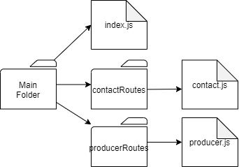
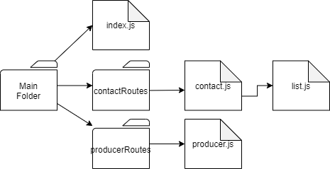
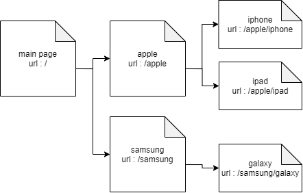

# QUESTION & ANSWER
* express 공부하면서 나온 질문 외에도 다른 질문도 할거임
---
## QUESTION_1

module.exports = 변수 에서 module.exports 는 어디에 변수를 보내는 거?

## ANSWER_1
---
## QUESTION_2

```javascript
const app = express
```

위의 소스에서 app 에 굳이 저장을 해야 하는 건가? app 에 저장하는 것이 아니라 사용자가 지정한 변수에 저장하면 안됨?

## ANSWER_2

---
## QUESTION_3



위와 같은 구조를 코딩 했는데([링크](https://github.com/jeahun10717/nodejsStudy/tree/master/expressStudyByFastCampus/additionalSouceCode/2_routes_homework)) 라우터를 여러번 사용하여 아래와 같은 구조로 가능?


## ANSWER_3
---
## QUESTION_4



위 구조를 각각의 다중 라우터로 작성([링크](https://github.com/jeahun10717/nodejsStudy/tree/master/expressStudyByFastCampus/additionalSouceCode/3_viewEngine_prac)). 왜 안됨?

## ANSWER_4
---
