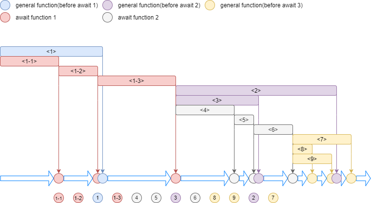

# QUESTION & ANSWER
* express 공부하면서 나온 질문 외에도 다른 질문도 할거임

|Q&A index|해결 여부|
|---|---|
|1. module.exports 관련|`complete`|
|2. const app = express()|`complete`|
|3. multi router|`complete`|
|4. DOM 이란?|X|
|5. res의 중복사용|X|
|6. refused to apply~ 오류 해결|X|
|7. template engine 에서 다른 폴더 참조|`complete`|
|8. express.static() 사용법|`complete`|
|9. 웹페이지<-->서버 간 data 전송|`complete`|
|10. middleWare 실행순서|`complete`|
|11. 비동기함수 실행순서|`complete`|

---

## QUESTION_1 : module.exports

`module.exports = 변수` 에서 `module.exports` 는 어디에 변수를 보내는 거?

## ANSWER_1

```javascript
module.exports = app;
```

위의 소소는 `app` 이라고 하는 변수(객체)를 `module.exports` 를 통해 wrapping 을 하여 객체 형태로 만들어 둔다. 그 후 이 wrapping 된 객체가 필요할 때 아래와 같이 불러와서 사용할 수 있다.

```javascript
const 변수 = require('js파일경로')
```

---

## QUESTION_2 : const app = express()

```javascript
const app = express()
```

위의 소스에서 app 에 굳이 저장을 해야 하는 건가? app 에 저장하는 것이 아니라 사용자가 지정한 변수에 저장하면 안됨?

## ANSWER_2

```javascript
const app = express();
```

위의 소스는 `app` 이라는 변수에 `express` 모듈을 저장하여 `app` 의 하위 메소드나 프로퍼티로 `express` 를 사용하기 위한 소스이다. 따라서 app 이 아닌 다른 변수를 사용하더라도 문제가 없다.

---

## QUESTION_3 : multi router source

아래와 같은 폴더 구조로 router 를 다중으로 쓰는 소스를 만들 수 있음?


## ANSWER_3

소스 짜 놨음 참고하셈. 링크는 밑에
[link](https://github.com/jeahun10717/nodejsStudy/tree/master/expressStudyByFastCampus/additionalSouceCode/4_multi_router)

---

## QUESTION_4 : DOM

DOM 구조란?

## ANSWER_4

---

## QUESTION_5 : res, req, next

```javascript
app.get('/', (req,res)=>{
  res.render('file');
  res.send('this is file of pug')
})
```

위의 소스는 동작하지 않는다. 이유는? => `res` 에 관해 공부하기

## ANSWER_5

---

## QUESTION_6 : refused to apply~ 오류 해결

`Refused to apply style MIME type error` 오류 해결방법

1. 이거 오류 발생하는데 해결방법으로 static 설정을 추가하면 되는데 왜 추가해야 함?
2. 정확한 해결방법과 제일 좋은 방식으로 front 작성하는 방법은?

질문에 대한 소스는 [이 링크의]() `4_viewInheritance` 폴더를 참고할 것
[이 링크](https://expressjs.com/ko/starter/static-files.html)를 참조하여 공부해 볼 것.

## ANSWER_6

---

## QUESTION_7 : template 에서 다른 파일 참조


위의 도식에서 `mainPage.pug` 는 `header.pug` 파일을 `extend` 한다. 이렇게 같은 폴더 안에 있는 파일을 `extends` 하는 건 할 수 있겠는데 외부 폴더에 있는 건 어떻게 접근해야 하나? 밑의 도식처럼 코딩을 하려면 어떻게 해야 하나? 즉 `./mainFolder/admin/adminPage.pug` 에서 `./mainFolder/layout/header.pug` 를 참조(`extends`) 하고 싶은데 어떻게 해야 함?


[소스 파일이 이 링크를 타고 가면 됨]()

## ANSWER_7

위의 질문을 해결하기 위해서는 아래의 2가지 문제를 해결해야 한다.

1. 다른 폴더에 존재하는 파일을 접근하는 것
2. `extend <file path>` 부분의 의미

* `1.` 에 대한 답은 간단하다. 아래의 표를 보고 확인해 보자.
```
/   = Root directory
.   = This location(현재 위치)
..  = Up a directory(상위 위치)
./  = Current directory(최근 위치)
../ = Parent of current directory(최근 위치의 상위 위치)
../../ = Two directories backwards
```

* `2.` 에 대해 알아보자.

file path 는 말 그대로 extends 할 파일이 존재하는 위치이다. 위의 1. 의 답의 표를 보고 작성하면 된다.

[이를 해결한 소스는 이 링크로 가면 된다.](https://github.com/jeahun10717/nodejsStudy/tree/master/expressStudyByFastCampus/additionalSouceCode/4.2_viewInheritance)

## QUESTION_8 : express.static()

```javascript
express.static('/URL', 'filePath') 에서 url 부분 정확히 이해가 안됨
```

이 링크의 소스에서 index.js 부분을 보면

### 문제상황 1

```javascript
app.use('/imgURL', express.static('imgFiles'))// 정적파일 설정
```

위의 소스를 사용하면 아래와 같이 `http://localhost:4000` 에서 이미지가 출력이 안된다.


하지만 `http://localhost:4000/imgURL/expressStudyImg19.png` 로는 들어가 진다.

### 문제상황 2

```javascript
app.use('/imgFiles', express.static('imgFiles'))// 정적파일 설정
```

위의 소스를 사용하면 즉 `/URL` 부분과 `filePath` 부분이 일치하면 아래와 같이 `http://localhost:4000` 부분은 출력이 되나 `http://localhost:4000/imgURL/expressStudyImg19.png` 페이지는 출력이 안된다. 왜 그런가?


## ANSWER_8

`http://localhost:4000` , `http://localhost:4000/imgURL/expressStudyImg19.png` 2개의 링크에서 모두 보이게 하기 위해서는 아래와 같은 소스를 사용하면 된다.

```javascript
app.use('/imgURL', express.static('imgFiles'))
```

```pug
html
    head
    body
        #testBox(style="width : 100px; height : 200px; background-color : aqua")
        img(src="../../imgURL/expressStudyIMG18.png")
```

이렇게 작성하면 모든 링크에서 접근이 가능하다.
app.use 안의 `'/imgURL'` 과 img(src="../../`imgURL`/expressStudyIMG18.png") 안의 `imgURL` 만 맞춰주면 된다.

---

## QUESTION_9 : fromt to back, back to front data send

여기 있는 링크에 소스가 있다. 이 소스에서 변수를 js 파일에서 template 으로 데이터를 보낼 때 아래와 같이 js 파일마다 모두 설정해야 하나?

**[SOURCE-index.js]**

```javascript
//생략

//******************************
app.use((req,res,next)=>{
    app.locals.isLogin=true;
    next();
})
//******************************

//셍략
```

**[SOURCE-apple.js]**

```javascript
//생략

routerOfApple.use((req,res,next)=>{
    routerOfApple.locals.isLogin = true;
    next();
})

//생략
```

## ANSWER_9

---

## QUESTION_10 : middleware 실행순서

미들웨어 함수, app.use 같은 미들웨어의 실행순서?

## ANSWER_10

```javascript
app.use(/*use 1*/)
app.use(/*use 2*/)

function test1(params) {/*내용*/}
function test2(params) {/*내용*/}
app.get('/', test1, test2, (req,res,next)=>{//app.get<1>
    //내용
})
app.get('/testLink', test1, (req,res,next)=>{//app.get<2>
    //내용
})
```

위의 함수들의 실행순서는 아래와 같다.


---

## QUESTION_11 : asyncronous function 실행순서

**[SOURCE]**

```javascript
const firstFunc = function (delayTime) {
    return setTimeout(function(){
        console.log('1st function');       
    }, delayTime);
}
const secondFunc = function (delayTime) {
    return setTimeout(function(){
        console.log('2nd function');       
    }, delayTime);
}
const thirdFunc = function (delayTime) {
    return setTimeout(function(){
        console.log('3rd function');       
    }, delayTime);
}


const asyncFunction = async () => {
    await firstFunc(1500);
    await secondFunc(500);
    await thirdFunc(1000);    
}

asyncFunction();
```

**[CONSOLE]**

```
2nd function
3rd function
1st function
```

위의 소스코드에서 우리가 기대하는 콘솔값은 아래와 같은데 다른 값이 나온다. 그 이유는?

```
1st function
2nd function
3rd function
```

## ANSWER_11

기본적으로 `async-await` 문 역시 `Promise` 기반으로 작동한다. 즉 `Promise` 에서 `Promise` 를 생성하고 그 `Promise` 를 리턴값으로 받아서 비동기 처리를 하는 그 과정을 `async-await` 이 동일하게 작동한다. 위의 `Qusetion_11` 에서 만들어진 3개의 함수의 리턴값은 `Promise` 가 아니다. 정리해 보자

1. `asnyc-await` 은 그 태생이 `Promise` 에 있으므로 메커니즘 역시 동일하다.
2. `await` 이 받는 리턴값은 **반드시!!** **`Promise`** 이여야 한다.

즉 아래와 같이 전달하는 함수의 리턴값을 Promise 로 해 주어야 정상적으로 작동한다.

**[SOURCE]**

```javascript
function firstFunc(sec){
    return new Promise(function(resolve, reject){
        setTimeout( function(){
            console.log('1st function');                   
            resolve("async는 Promise방식을 사용합니다.");
        }, sec);
    });
}
function secondFunc(sec){
    return new Promise(function(resolve, reject){
        setTimeout( function(){
            console.log('2nd function');                   
            resolve("async는 Promise방식을 사용합니다.");
        }, sec);
    });
}
function thirdFunc(sec){
    return new Promise(function(resolve, reject){
        setTimeout( function(){
            console.log('3rd function');                   
            resolve("async는 Promise방식을 사용합니다.");
        }, sec);
    });
}


const asyncFunction = async () => {
    await firstFunc(1500);
    await secondFunc(500);
    await thirdFunc(1000);    
}

asyncFunction();

// await func1 에서 func1 은 Pomsie 를 반환?
```

**[CONSOLE]**

```
1st function
2nd function
3rd function
```

await 을 사용한 소스와 그렇지 않은 소스 간의 실행순서에 대해 알아보자. test 해 볼 소스는 아래와 같다.

**[SOURCE]**

```javascript
function firstFunc(sec, linenum){
    return new Promise(function(resolve, reject){
        setTimeout( function(){
            console.log(`1st function : ${linenum}`);                   
            resolve("async는 Promise방식을 사용합니다.");
        }, sec);
    });
}

// secondFunc, thirdFunc 는 위의 소스와 동일하므로 생략

const asyncFunction = async () => {
    setTimeout(() => console.log('소스상 1 번째 : <1>'), 2600); //<1>

    await firstFunc(1500, '<1-1>')
    await firstFunc(1000, '<1-2>')
    await firstFunc(2000, '<1-3>')

    setTimeout(() => console.log('소스상 2 번째 : <2>'), 4100); //<2>
    setTimeout(() => console.log('소스상 3 번째 : <3>'), 2100); //<3>

    await firstFunc(1500, '<4>');//<4>
    await secondFunc(500);//<5>
    await thirdFunc(1000);//<6>    

    setTimeout(() => console.log('소스상 4 번째 : <7>'), 1500);//<7>
    setTimeout(() => console.log('소스상 5 번째 : <8>'), 500);//<8>
    setTimeout(() => console.log('소스상 6 번째 : <9>'), 1000);//<9>
}
```

**[CONSOLE]**

```
1st function : <1-1>
1st function : <1-2>
소스상 1 번째 : <1>
1st function : <1-3>
1st function : <4>
2nd function : <5>
소스상 3 번째 : <3>
3rd function : <6>
소스상 5 번째 : <8>
소스상 6 번째 : <9>
소스상 2 번째 : <2>
소스상 4 번째 : <7>
```

위의 소스의 실행 순서는 아래 도식과 같다.



asnyc-await 을 사용할 때 기본적으로 3가지 계층으로 나뉜다.

1. `before await functions 1, 2`
2. `await functions 1, 2`
3. `after await functions`

* `1. before await functions`, `2. await functions` 은 비동기적으로 실행이 된다. 하지만 `2. await functions` 은 동기적으로 실행된다.
* await 함수가 실행되는 도중에는 모든 실행이 중단되며 await 만이 실행된다.
* `3. after await functions` 부분은 `2. await functions` 들이 종료 된 시점에 실행이 된다.

정리하자면 await 과 일반 함수를 async 안에서 연속으로 사용할 때 `일반함수 - await 함수` 를 한개의 블록으로 생각하면 된다.</br>
[위에서 사용된 소스는 이 링크에 있다.](https://github.com/jeahun10717/nodejsStudy/tree/master/expressStudyByFastCampus/additionalSouceCode/ansycronousTESTFile.js)
